# Tugas-Bhsa-pemrograman-pertemuan-6
Repository ini dibuat untuk memenuhi tugas bahasa pemrograman pertemuan ke 6
 
 Nama  : Antini permatasari
 
 NIM   : 312010095
 
 Kelas : TI.20.B.1<br><br>
 
 DAFTAR ISI <br>
 | No | Description | Link |
 | ----- | ----- | ---- |
 | 1  | Tugas pertemuan 5 | [Tugas_pertemuan_5](#pertemuan6_smt1#pertemuan-5---tugas)
 | 2  | Tugas pertemuan 6 Lab 1 | [Tugas_part6_Lab1](#pertemuan-6---Lab-1)
 | 3  | Tugas pertemuan 6 Lab 2 | [Tugas_part6_Lab2](#pertemuan-6---Lab-2)
 <br>
 
 ## pertemuan 5 - Tugas
 
 pada pertemuan 5 Bahasa pemograman saya diberi tugas oleh Dosen membuat Aplikasi Biodata python (seperti)
 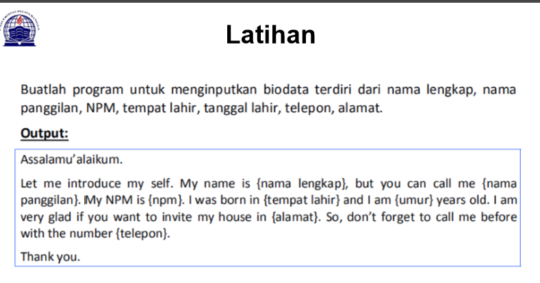 <br>
 saat ini saya akan menjelaskan hasil dari tugas tersebut.<br>
 Berikut *source code* nya atau link berikut ( [tugas pertemuan 5](p5.tugas.py) ): <br>
 ```python
print("please enter full name : ")
fullname=input()

print("please insert your Nickname : ")
nickname=input()

print("please enter your NPM : ")
NPM=input()

print("please enter your Born place : ")
bornplace=input()

print("please insert your age : ")
age=input()

print("please enter yuor home address : ")
address=input()

print("pleace enter your phone number : ")
phonenumber=input()


print("\nAssalammualaikum wr, wb.")
print(f"\nLet me introduce my self. My name is{fullname}, but you can call me(nickname). My NPM is{NPM}. I was Born in {bronplace} and i am {age} years old. I am very glad if you want to invite my house in {address}. So, don't forget to call me before with the number {phonenumber}.")
print("\nThank you.")
print("\n")
``` python
berikut penjelasan : <br>
``` python
print("please enter full name : ")
```
source code diatas berfungsi untuk mencetak hasil / output berupa " **please enter your full name : **" (seperti gambar dibawah ini)<br>
untuk menampilkan output string, saya menggunakan *tanda petik dua* didalam fungsi print(), sedangkan jika saya ingin menampilkan output /atau hasil berupa angka/interger saya tidak perlu menggunakan *tanda petik dua*. contohnya :
``` python
print ("Nama saya adalah ...")
print(1234567)
``` 
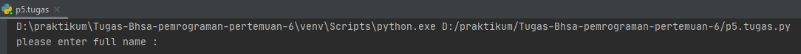<br>
* untuk source code berikutnya adalah inputan atau membuat variable, seperti syntax dibawah ini :
```python
fullname=input()
```
keterangan :<br>
1. variable adalah sebuah penyimpanan data pada program yang akan digunakan sealam program ini berjalan. yang berfungsi sebagai variable dalam source code diatas adalah **Fullname** . <br>
2. fungsi **input ()** adalah untuk memasukkan nilai dari layar console di command prompt, lalu kemudian mengmbilkan nilai saat kita menekan tombol enter
*(newline)*<br>

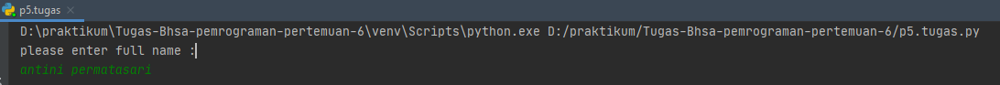

pada gambar diatas,hasil dari inputan tersebut berwarna *hijau*<br>

* untuk perintah masukan yang lain seperti *nikname, NPM, Born, age, home, phone numbe, masukan perintah yang sama seperti memasukkan *fullnmae*

* Langkah kali ini saya akan menampilkan output yang diminta oleh Dosen,<br>
output pertama yang diminta dosen adalah menampilkan salam, yaitu dengan mengetikkan 
syntex/source code berikut :
```python
print("\n\n Assalammualikum")
```
ket :
1. Fungsi ***\n*** pada source code diatas adalah untuk memberi warisan baru / enter / *newline*
2. Fungsi print (), seperti dijelaskan pada point *output* diatas
Hasil dari source code diatas adalah seperti gambar dibawah ini :

*langkah terakhir adalah menampilkan dari semua inputan diatas. Dengan mengetikan source code berikut : <br>
```python
print("\nAssalammualikum wr, wb.)
print("\nLet me introduce my self. My name is {fullname}, but you can call me {nickname}. My NPM is {npm}. I was born in {bornplace} and i am {age} years old. I am very glad if you want to invite my house in {address}. So, don't forget to call me before with  the number {phonenumber}.")
print("\nThank you.")
```
ket :
1. Fungsi huruf ***f*** pada perintah **print(f"...)** adalah fungsi print yang dapat memudahkan programer untuk mencetak statement dalam satu baris dibandingkan dengan metode yang lama yaitu memisahkan string dan variable dengan simbol koma ( , ) atau ( + )<br>
2. Sedangkan fungsi {} pada output tersebut adalah untuk menampilkan hasil dari variable<br>
Hasil dari output tersebut adalah :
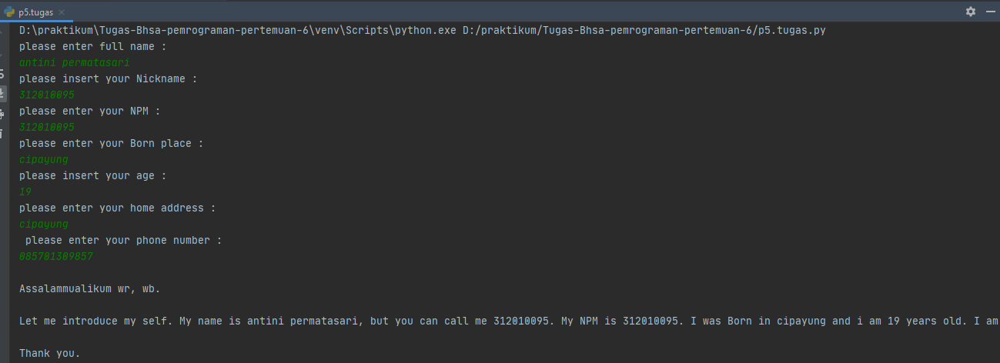

<br>
---
<br>

## pertemuan 6 - Lab 1
Pada tugas pertemuan 6 - lab 1 saya diberikan tugas oleh Dosen yaitu mempelajari Aritmatika menggunakan bahasa pemprograman python. Berikut source code yang diberikan oleh Dosen :
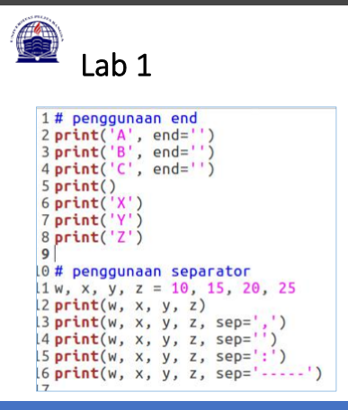
```python
#penggunaan end
print('A', end='')
print('B', end='')
print('C', end='')
print()
print('X')
print('Y')
print('Z')

#penggunaan separator
w, x, y, z = 10, 15, 20, 25
print(w, x, y, z)
print(w, x, y, z, sep=',')
print(w, x, y, z, sep='')
print(w, x, y, z, sep=':')
print(w, x, y, z, sep='-----')
```
kali ini saya akan menjelaskan materi yang diterima oleh Dosen.<br><br>

*penggunaan End
penggunaan end digunakan untuk menambahkan karakter yang dicetak diakhir baris. Secara default penggunaan end adalah untuk garis baris.
``` python
print("A", end="")
print("B", end="")
print("C", end="")
```

> penggunaan print() digunakan untuk mencetak output, seperti syntax dibawah ini :
```python
print("X")
print("X")
print("Z")
```
Hasil dari source code tersebut seperti gambar dibawah ini :<br>
![]
print
<br>
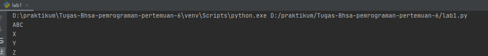<br>

* penggunaan separator
separator adalah pemisah yang berfungsi sebagai tana pemisah antar objek yang dicetak, Defaulnya adalah tanda seperti. <br><br>

> pendeklarasian beberapa variable beserta nilainya
```python
print(w,x,y,z,sep=",")
```
> menampilkan hasil dari tiap-tiap variable dengan menggunakan pemisah , (koma)
```python
print(w,x,y,z,sep=")
```
> menampilkan hasil dari tiap-tiap variable tanpa menggunakan pemisah
```python
print(w,x,y,z,sep=")
```

Hasil dari syntax / source code diatas adalah seperti berikut ini : <br>
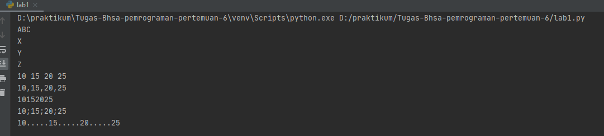

<br>
<br>
<br>

## pertemuan 6 - Lab 2

* string format
string formating atau performatan string memungkinkan kita menyuntikan item kedalam string dari pada kita mencoba menggunakan string menggunakan koma atau string concatanation.<br>

penggunaan source code yang diberikan oleh dosen seperti : <br>
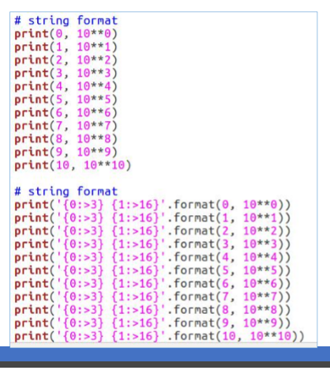
``` python
#string format 1
print(0, 10**0)
print(1, 10**1)
print(2, 10**2)
print(3, 10**3)
print(4, 10**4)
print(5, 10**5)
print(6, 10**6)
print(7, 10**7)
print(8, 10**8)
print(9, 10**9)
print(10, 10**10)

#string format 2
print('{0:>3} {1:>16}'.format(0, 10**0))
print('{0:>3} {1:>16}'.format(1, 10**1))
print('{0:>3} {1:>16}'.format(2, 10**2))
print('{0:>3} {1:>16}'.format(3, 10**3))
print('{0:>3} {1:>16}'.format(4, 10**4))
print('{0:>3} {1:>16}'.format(5, 10**5))
print('{0:>3} {1:>16}'.format(6, 10**6))
print('{0:>3} {1:>16}'.format(7, 10**7))
print('{0:>3} {1:>16}'.format(8, 10**8))
print('{0:>3} {1:>16}'.format(9, 10**9))
print('{0:>3} {1:>16}'.format(10, 10**10))
```
<br>
saat ini saya akan membahas satu persatu dari syntax yang telah diberikan oleh Dosen. <br>

1. String format 1 <br>
pada syntax / source code string format 1 akan menampilkan output berupa 2 output.<br>
yang pertama (sebelah) akan menampilkan angka urut dari angka 0 hingga angka 10, sedangkan untuk angka sebelah kanan akan menampilkan operasi Aritmatika pangkat.<br>
Dengan ketentuan sebagai berikut, operasi pangkat dengan kiri sebagai pokok (Rumus **[bintang dua])<br>
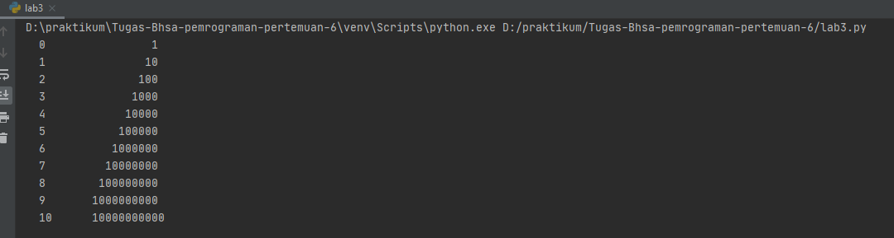

\
2. **string format 2** <br>
pada syntax source code string format 2 akan menampilkan outputan juga (seperti string format 1, yaitu karna dan kiri)<br>
Dengan ketentuan sebagai berikut : <br>
> Aligment, padding, dan percesion dengan **.format** dalam kurung kurawal kita dapat menetapkan panjang bidang, rata kanan/kiri, parameter pembulatan dan banyak lagi. contoh lain seperti berikut : <br>
```python
print('{0:8} | {1:9}'.format('Buah','jumlah'))
print('{0:8} | {1:9}'.format('Apel', 3.))
print('{0:8} | {1:9}'.format('jeruk',10))
```
Hasil dari source code contoh diatas akan seperti berikut : <br>
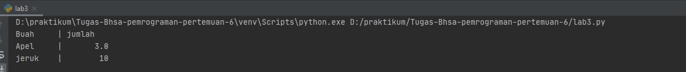
>secara Default, **.format** menggunakan rata teks ke kiri, angka ke kanan. kita dapat menggunakan opsi opsional <, ^, atau > untuk mengatur perataan kiri, tengah, atau kanan. contoh lain dalam penggunaan **.format()** sebagai berikut : <br>
```python
print('{:<30}{:^30}{:>30}'.format('kiri','Tengah','kanan'))
print('{:<30}{:^30}{:>30}'.format(12,34,56))
```
Hasil dari source code contoh diatas akan muncul seperti ini :<br>
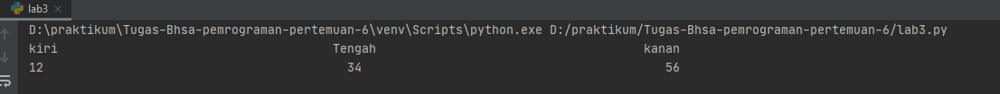
<br><br>
untuk hasil dari string format 2 adalah :<br>
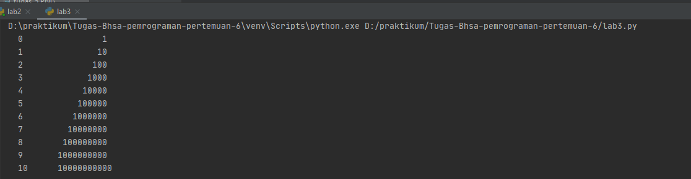

## pertemuan 6 - Lab 2
* konversi nilai variable
untuk pembahasan terakhir,kali ini akan menyelesaikan tugas lab 2 dari Dosen, yaitu konversi nilai variable <br>
tugas yang dierikan dosen adalah seperti gambar dibawah ini atau bisa di akses ke link [pertemuan 6 - lab 2](lab2.py):<br>
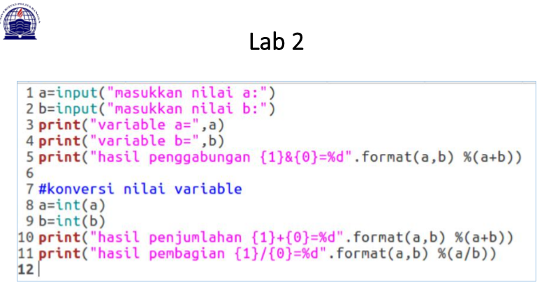
```python
a=(input("masukan nilai a:")
b=(input("masukan nilai b:")
print("variable a=",a)
print("variable b=",b)
print("hasil penggabungan {1}&{0}=%d".format(a,b) %(a+b))

#konvesi nilai variable
a=int(a)
b=int(b)
print("hasil penjumlahan {1}+{0}=%d".format(a+b))
print("hasil pembagian {1}/{0}=%d".format(a,b) %(/b))
```
<br>
setelah saya menjalankan source code tersebut terdapat error, seperti gambar dibawah ini :<br>

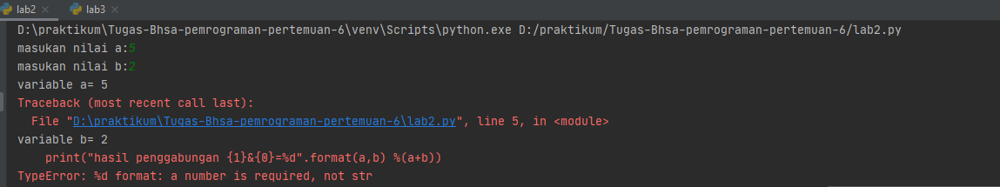<br>
nah, untuk kali ini akan membaca error, yang telah terjadi.<br>
>**Typeerror: %d format: a number is required, not str** <br>

Pada error tersebut terbaca bahwa variable a adalah string, yang harus di baa oleh sistem namber/ interger.<br>
*Bagamana cara memperbaiki error tersebut?*<br>
Kita lihat pada garis 5 (dinotifikai tebaca bahwa error terletak pada baris ke 5), yaitu pada pemformatan **.format()** Adalah interger. 
Sedangkan jika berupa string maka akan ada tanda petik dua ("..") pada pemformatan **.format()**<br>
kita akan berfokus pada variable a dan b.<br>
pada line 1 tertulis syntax : *a=input("Masukkan Nilai A : ")* <br>
sedangkan line 2 tertulis syntax : *b=input(Masukkan Nilai B : ")* <br>
untuk membuat inputan berupa interger /angka harus ditambahkan syntax int() pada format. yang seharusnya ditulis adalah : <br>
```python
a=int(input("masukkan nilai a:"))
b=int(input("masukkan nilai b:"))
print("variable a=",a)
print("variable b=",b)
print("hasil penggabungan {1}&{0}=%d".format(a,b) %(a+b))

#konversi nilai variable
a=int(a)
b=int(b)
print("hasil penjumlahan {1}+{0}=%d".format(a,b) %(a+b))
print("hasil pembagin {1}/{0}=%d".format(a,b) %(a/b))
```
kita akan mencoba untuk *run* file tersebut, maka akan muncul seperti gambar dibawah ini :<br>
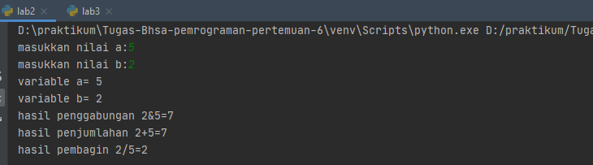
<br><br>
<hr>
Setelah file berhasil disimpan dan dijalankan, maka selesai sudah tugas pertemuan 6 - Bahasa pemrograman kali ini.
<br>

##========== THANK YOU =========== <br>
## Antini permatasari /312010095/TI.20.B.1 <br>
##================================ <br>


``` 
source 